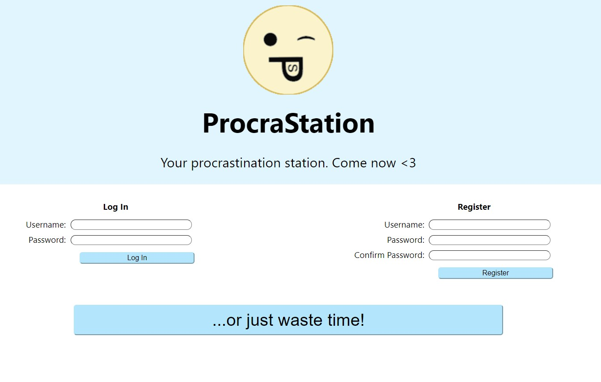
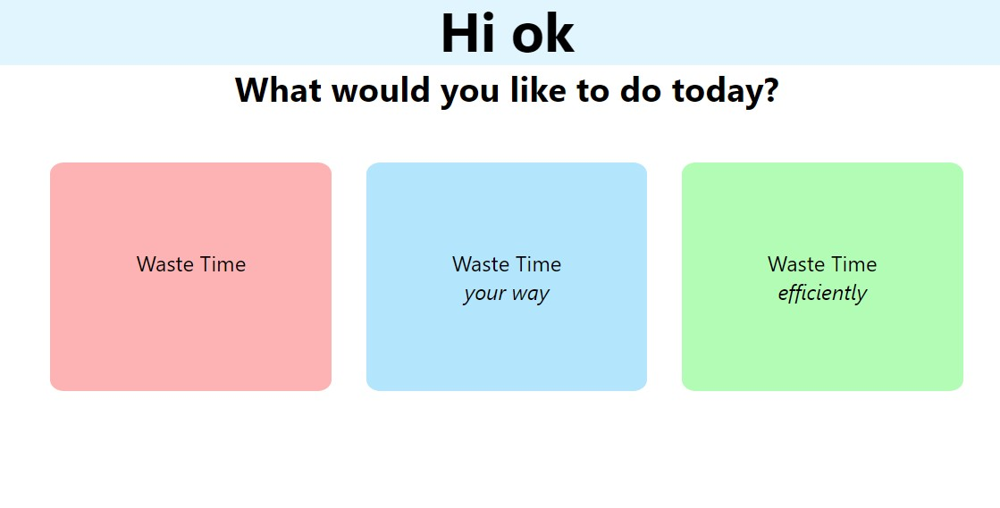
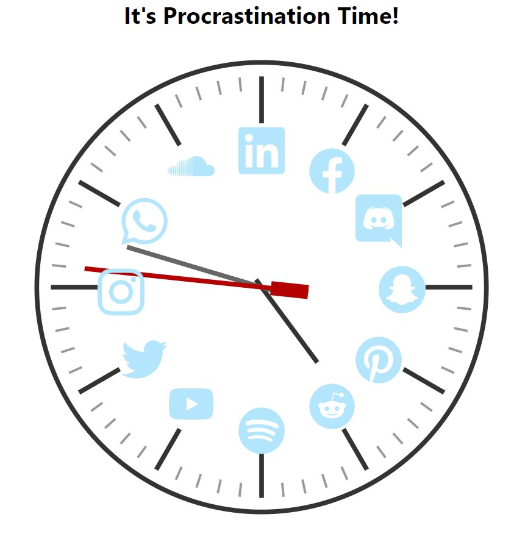
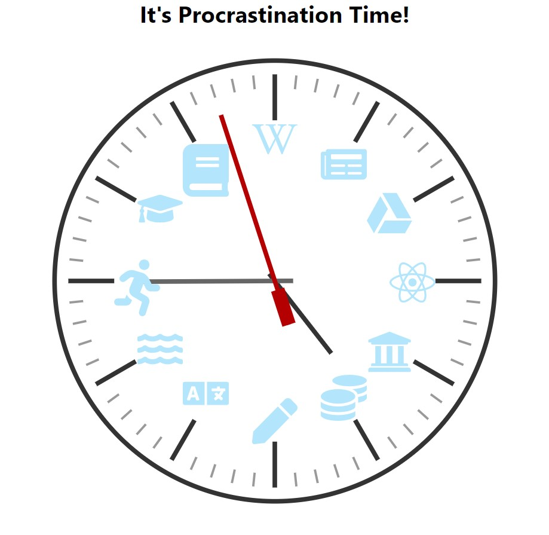
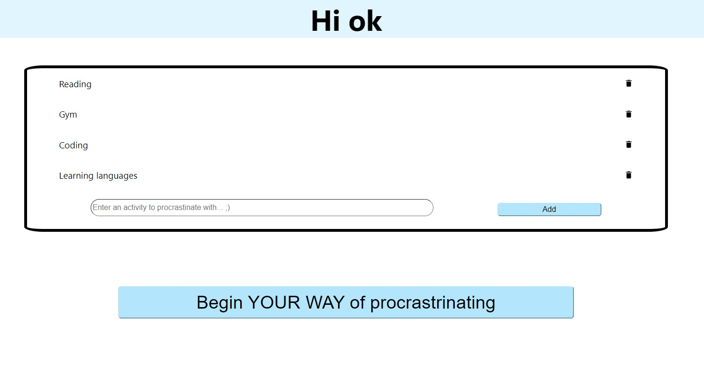
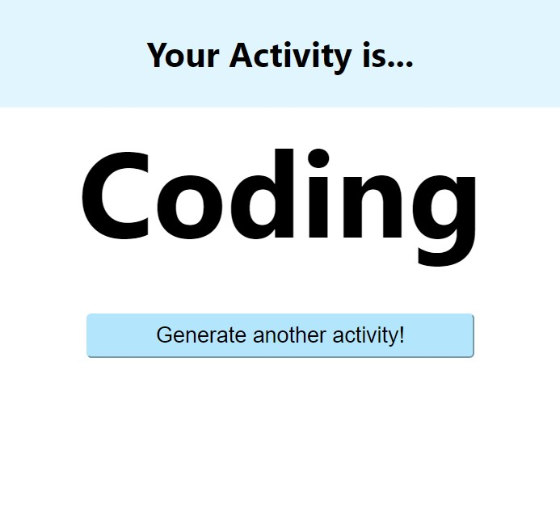

# ProcraStation

### Your station for procrastination ;)

## WDCCxSESA Hackathon 2021
This application was made for the WDCCxSESA Hackathon for 2021, which had the theme of "Pro-crastination", not doing what you're supposed to as effectively as possible. It was a hackathon from Saturday 09:00 AM till Sunday 04:00 PM.

## Techstack
We have used a MERN stack for the application - MongoDB for the database, Express for the backend, ReactJS for the frontend, and lastly NodeJS for the backend as well.

## Clone and setup

## Application flow
First you are at the homepage. Here you can sign up and/or login. If you sign up it automatically loads the next page as if you logged in.

After you are logged in you go to the Wasting_Choices page, herer you can pick whether to "Waste time", "Waste time efficiently", and "Waste time your way".

If you choose to waste time then it takes you to our social media clock, which is where you can pick 1 of 12 social media sites to waste your time on.

However, if you choose to waste your time efficiently then that option takes you to our efficient clock, which is where you can pick 1 of 12 sites to procrastinate by doing something which is potentially productive (for example, exercising).

Lastly, if you choose to waste time your way then that will take you to a page with your list of activities, you can add or delete your activities there. Once you are happy with the list of activities you can then press "Begin YOUR WAY of procrastinating".

There it will bring up a randomly selected activity from your list of activities.

